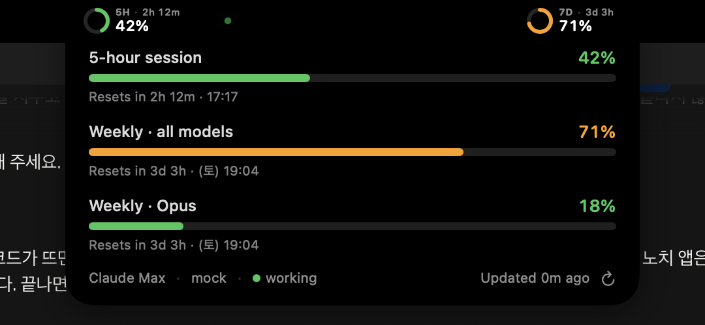

# NotchUsage

Claude Code usage limits, right in your MacBook's notch.

Hover the notch to see your **5-hour session** and **weekly** utilization with reset timers. On Macs without a notch it hangs as a small island at the top of the screen, and there is always a menu bar item as well.




- Reads the same numbers that Claude Code's `/usage` shows (`api.anthropic.com/api/oauth/usage`).
- No API key, no extra cost. It reuses the Claude Code login already on your Mac.
- Auto-refreshes the OAuth token when it expires (same flow Claude Code uses) and writes it back so `claude` keeps working too. Can be turned off in the menu.
- Reset countdown next to each gauge, even when collapsed.
- A small green dot beside the notch pulses while Claude Code is writing a transcript (FSEvents on `~/.claude/projects`); the expanded footer shows whether sessions are working, idle, or absent.
- Polls once a minute, backs off on `429`.
- Launch at login, show/hide notch island, show/hide % in the menu bar.

## Requirements

- macOS 14 Sonoma or later (Apple Silicon or Intel).
- [Claude Code](https://docs.anthropic.com/en/docs/claude-code) signed in with a Claude subscription (`claude` → `/login`). Usage limits are a subscription feature; API-key logins have no 5-hour/weekly window.
- Xcode 15+ (or Command Line Tools with a Swift 5.10 toolchain) to build.

## Build & run

```bash
git clone https://github.com/minsueh/notch-usage.git
cd notch-usage
make run          # builds build/NotchUsage.app and opens it
make install      # copies it to /Applications
```

The first launch asks for access to the **"Claude Code-credentials"** Keychain item. Click **Always Allow**; that is how the app reads (and refreshes) the token.

`make icon` regenerates `Resources/AppIcon.icns` from `Scripts/make-icon.swift`.

## How it works

1. Loads Claude Code's credentials from the login Keychain (service `Claude Code-credentials`), falling back to `~/.claude/.credentials.json` (or `$CLAUDE_CONFIG_DIR`).
2. If the access token is expired, refreshes it with Claude Code's public OAuth client id and saves the new token back in the same format.
3. Calls `GET /api/oauth/usage` with `anthropic-beta: oauth-2025-04-20` and renders `five_hour`, `seven_day`, and the per-model weekly windows when present.

Environment flags for development:

| Flag | Effect |
|---|---|
| `NOTCHUSAGE_DEBUG=1` | Echo logs to stderr (also visible in Console.app under subsystem `io.github.minsueh.NotchUsage`). |
| `NOTCHUSAGE_MOCK=1` | Show sample data; no Keychain or network access. |
| `NOTCHUSAGE_EXPANDED=1` | Start with the island expanded (for screenshots). |

## Troubleshooting

- **Menu bar shows `!`** – open the menu to read the error. Most common: the token *and* its refresh token are expired. Run `claude` in Terminal and `/login` once; the app picks it up on the next poll.
- **`Keychain error`** – you denied the Keychain prompt. Quit the app, open Keychain Access, find "Claude Code-credentials" → Access Control, and add NotchUsage, or just relaunch and click Always Allow.
- **Rebuilt the app and the prompt is back** – ad-hoc signatures change with every build. Sign with your own Developer ID in `Scripts/build-app.sh` if that bothers you.
- **Island overlaps a menu bar icon** – it extends about 100pt on each side of the notch. Turn it off with "Show in Notch" and rely on the menu bar item, or shrink `sideWidth` in `NotchView.swift`.

## Privacy

Everything stays on your Mac. The only network calls go to `api.anthropic.com` (usage) and `platform.claude.com` / `console.anthropic.com` (token refresh). No analytics, no third-party servers.

## License

MIT

---

## 한국어

맥북 노치에서 Claude Code의 **5시간 세션**과 **주간** 사용량을 바로 보는 메뉴바 앱입니다. 노치에 마우스를 올리면 리셋까지 남은 시간과 함께 펼쳐집니다. 노치 없는 맥에서는 화면 상단 중앙에 작은 아일랜드로 붙고, 메뉴바 아이템은 항상 있습니다.

- Claude Code의 `/usage`와 같은 엔드포인트를 그대로 읽습니다. 별도 API 키나 추가 비용이 없습니다.
- 맥에 이미 로그인된 Claude Code 자격증명(키체인)을 재사용하고, 만료되면 Claude Code와 같은 방식으로 토큰을 갱신해 다시 저장합니다. 메뉴에서 끌 수 있습니다.
- 접힌 상태에서도 게이지 옆에 리셋까지 남은 시간 표시.
- Claude Code가 대화 기록을 쓰는 동안 노치 옆 초록 점이 맥박처럼 뜁니다(`~/.claude/projects` 파일 이벤트). 펼치면 세션이 작업 중인지, 대기 중인지, 없는지 하단에 표시.
- 1분마다 갱신, `429`면 대기.
- 로그인 시 실행, 노치 표시 켜고 끄기, 메뉴바 % 표시 켜고 끄기.

### 빌드

```bash
git clone https://github.com/minsueh/notch-usage.git
cd notch-usage
make run
```

처음 실행하면 "Claude Code-credentials" 키체인 접근을 묻습니다. **항상 허용**을 누르세요.

### 문제 해결

- **메뉴바에 `!`** 메뉴를 열면 오류 메시지가 보입니다. 대개 토큰과 갱신 토큰이 모두 만료된 경우이므로 터미널에서 `claude`를 실행해 `/login`을 한 번 하면 됩니다.
- **키체인 오류** 접근을 거부한 경우입니다. 앱을 다시 열고 항상 허용을 누르거나, 키체인 접근 앱에서 "Claude Code-credentials" 항목의 접근 제어에 NotchUsage를 추가하세요.
- **메뉴바 아이콘과 겹침** 노치 양옆으로 100pt 정도씩 뻗습니다. "Show in Notch"를 끄거나 `NotchView.swift`의 `sideWidth`를 줄이세요.
